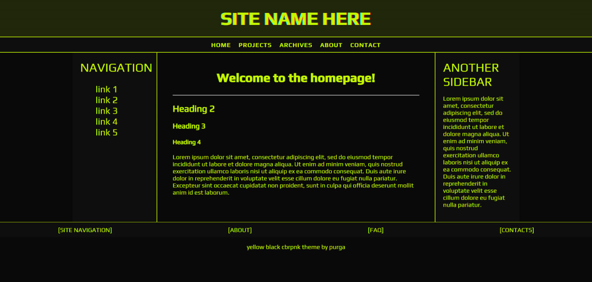

## About this website template

> "Yellow-black cbrpnk theme" is a theme for your website designed with Cyberpunk aesthetic (and, specifially, Cyberpunk 2077) in mind.
In fact, the color theme is loosely inspired by the Cyberpunk 2077's data breach UI.

Since this theme was made for use on neocities/nekoweb/similar websites, it is frontend-only.

## This template includes:
- html template with the site's structure (<i>adapted for mobile use as well</i>)
- css with all the styles
- scripts written in js for some popups (<u><i>if you don't like them, you can just <b>unlink them from an html file</b> (don't forget to <b>delete the stuff inside "data-breach-popup" and "data-breach-complete" divs!</b>) and then <b>delete the corresponding .js file from the folder</b></i></u>)
- folder with fonts used (you can find the exact same fonts on google fonts and link them via url. I myself don't find this method comfortable)

## Technologies used:
- html
- css
- vanilla javascript

## preview:
